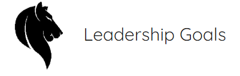

# Milestone Project 1 - Leadership Goals

The purpose of this project is to develop a website that promotes a fictional educational leadership development programme, Leadership Goals. It is a business to business website targeted at companies that are interested in developing leaders in their organisation.
The website will inform potential clients of the content of the programme, provide information about the company behind the course and give potential clients options for contacting Leadserhip Goals about the programme.

## Contents

- <a href="ux">1. User Experience </a>
- <a href="features">2. Features </a>
- <a href="tech">3. Technologies Used </a>
- <a href="test">4. Testing </a>
- <a href="deploy">5. Deployment </a>
- <a href="credit">6. Credits </a>

## 1. User Experience
 
This is a business to business website that provides potential clients with information on the content of the Leadership Goals development programme, the delivery location and the people that deliver the course.

### 1.1 User Stories
- As a manager looking to educate my team, I am able to find out information about the Leadership Goals development programme. I am able to quickly find out about the programme's content, where it is located and what are the benefits.

- As a potential student of the course, I am able to find out the benefits of the Leadership Goals Programme to both myself and my organisation. I can find out if it is suitable for me and I can contact Leadership Goals quickly.

- As a human resource manager of a large company, I can find out information on the programme for the potential development of my company's management team, I can establish the benefits of the programme and I can discover potential study options for my team.

### 1.2 Strategy
The goal of the project is to create an informative business to business website that showcases the Leadership Goals Programme and encourages potential clients to get in contact with the company. The website acts as an attractive window for clients to gain a basic understanding of the programme and entice them to find out more information.

### 1.3 Scope 
The website intends to anticipate what information that clients would like to know. With this in mind, introductory information is contained within the landing page and further details such as fees, gallery images and a contact form is available within a click of the homepage.

### 1.4 Structure
Based on the Scope Plane and what information I believe users require, the website is designed to provide key points about the course on the homepage with attractive and responsive elements. Once the client is confident in the quality of information available on the homepage, they will be encouraged to find uot more information by navigating through the website or contacting the company.

### 1.5 Skeleton
A mobile first approach was taken to designing the website. The original wireframes were created using Balsamiq and can be found below:

- Mobile Wireframe PDF - <a href="https://drive.google.com/open?id=139CHAjLGGtWzUlTY-bNublwHJQya23ho" rel="noopener" target="_blank">mobile version in PDF</a>.
- Desktop Wireframe PDF - <a href="https://drive.google.com/open?id=1ifq59VU_6UHgPFWvrcPonn4IZ5hT-syk" rel="noopener" target="_blank">desktop version in PDF</a>.

The wireframe mockups gave me a basic idea of how best to lay out each individual element that I wanted to incorporate into the project and how that would impact and enhance the user experience. As the project progressed, how best placement of these elements became apparent.

### 1.6 Surface
A blue and white colour scheme was initially decided upon to give a clean and crisp image to the site, I decided to add a teal colour, particularly for buttons and hover elemenets early on in the project. I chose the Quicksand font from Google Fonts as it fit in with my intended design. A mixture of rounded borders and angled borders as well as shadowing appear on different elements throughout the site in order to improve visual appeal.
***

## 2. Features

### 2.1 All Pages
The project has a clear and simple layout. The header includes a bespoke company logo that I designed using Pixlr and navigation links that underline when hovered over and are bold when active. The navigation bar is responsive and the navigation links compress to a burger icon in mobile view with a drop down expansion that is centred.

The main (hero) image on each page zooms in on loading, the main title is located within a jumbotron that is positioned over the main image.

The footer contains information to help the user contact and locate the company. On desktop view, the footer is split into three columns. The first column contains the companies contact details including address and phone number. The centre column contains the commpany's logo, this is not visible on mobile view. The right side column contains the company's social media links. These are fontaweosome icons and they change colour when hovered over. The appear at the bottom of the page on mobile view.

### 2.2 Homepage
I used a card deck to highlight the stages of the programme on the homepage together with icons and text. Each card in the card deck has a hover overlay effect that shows more information about each stage of the programme in a fade transition on each card. This allows users to get a quick introduction to the programme on the first page of the website before deciding to learn more in the Programme page.

The about us section was originally due to have its own page but I decided that it would fit better on the homepage itself. This is now contained within a revolving carousel and includes information about the Leadership Goals Company including two cards describing the team, one card on the training faciltity and one card the company's promise. The carousel contains four cards on two slides in desktop view. In mobile and tablet view one card per slide is visible, this was achieved through the addition of a second mobile and tablet view only carousel. This section allows users to get a better understanding of the company behind The Leadership Goals Programme through text and images.

### 2.3 Programme Page
The purpose of the Programme page is to give users a greater understanding of the Leadership Goals programme. Below the hero image, I have included a programme schedule on the left column inspired by The Code Institute's resume project. The other two columns include three rows that give an outline and further information on the three stages of the programme that are styled with the projexts colour scheme and include icons from Fontawesome.

The Course Fees section of the Programme page gives a brief outline of the course's fee schedule using a Bootstrap Progress Bar that is seperated into three sections. Individual course fees are not provided here but users are encouraged to contact the company using a button in this section that links to the contact form.

### 2.4 Contact Page
The Contact page provides users with a contact form below the hero images that encourages contact with the Leadership Goals Company to find our more information about the programme.

A large interactive and responsive map is located below the contact form. The map at this size provides users with a link to get directions to the Leadership Goals Centre of Excellence through Google Maps. The map also allows users to toggle between satelite and map view as well as zoom in and out.

### 2.5 Gallery Page
Below the hero image on the Gallery page are eight images that relate to the Leadership Goals Centre of Excellence. The images are designed to be all of the same height and width and each image opens a modal with a gallery carousel when clicked. A brief description of each image is located on each slide of the carousel.

### 2.6 Features Left to Implement
- I would like to add swipe functionality to the carousels on mobile devices. This is outside the scope of the project at this time and requires a knowledge of JavaScript.
- I would also like to add a pop up modal that thanks users for their submission when the form is filled out and all required fields have content.
***

## 3. Technologies Used

### 3.1 Languages 

I used the following languages for the project:
- **[HTML/HTML5](https://en.wikipedia.org/wiki/HTML5)**
  - The project used **HTML/HTML5** as this is the essential language of websites.

- **[CSS/CSS3](https://en.wikipedia.org/wiki/Cascading_Style_Sheets)** 
  - The project used **CSS/CSS3** to provide the styles for the website.

### 3.2 Frameworks 
- **[BootStrap 4](https://getbootstrap.com/)**
  - I used the **Bootstrap 4** Framework to design the website and add useful components and utilities including:
    - [Carousels](https://getbootstrap.com/docs/4.5/components/carousel/)
    - [Modals](https://getbootstrap.com/docs/4.5/components/modal/)
    - [Flexbox](https://getbootstrap.com/docs/4.5/utilities/flex/)
    - [Jumbotrons](https://getbootstrap.com/docs/4.5/components/jumbotron/)
    - [Cards](https://getbootstrap.com/docs/4.5/components/card/)
    - [Images](https://getbootstrap.com/docs/4.5/content/images/)
    - [Navbar](https://getbootstrap.com/docs/4.5/components/navbar/)

  - Within the Bootstrap 4 framework, the following libraries were used to add functionality to components:

### 3.3 Libraries

- **[JQuery](https://jquery.com)**
    - The project uses **JQuery** to add functionality to Bootstrap's components including Modals and Forms

- **[Fontawesome](https://fontawesome.com/)**
    - The project uses **Fontawesome** to add attractive icons to each of the project's pages.

- **[Google Fonts](https://fonts.google.com/)**
    - The Quicksand Font from Google Fonts is used throughout the project in different weights and colours.

### 3.4 IDE

- **[GitPod](https://www.gitpod.io/)**
    - Gitpod was used to develop the website and style each element before deployment.

### 3.5 External Hosting

- **[GitHub](https://github.com/)**
    - This project uses the GitHub hosting service and is saved in a GitHub repository.

- **[Google Drive](ttps://drive.google.com/)**
    - The wireframe PDF files are saved to a Google Drive account and are openly accessible.
***

## 4. Testing

### 4.1 Testing Technologies

- **[Balsamiq](https://balsamiq.com/)**
    - I used Balsamiq to design the original wireframes for the project and test how the layout looked. I reverted to Balsamiq when considering changes in the project's design.

- **[GTMetrix](https://gtmetrix.com/)**
    - GTMetrix was used to test the loading speed of each page and to find out if any elements were creating long loading times.

- **[W3C HTML Validator](https://validator.w3.org/)**
    - The W3C HTML Validator checked the website for HTML validity errors.

- **[W3C CSS Validator](https://jigsaw.w3.org/css-validator/)**
    - The CSS Validator checked for validity errors in the website's CSS page.

- **[Autoprefixer CSS Online](https://autoprefixer.github.io/)**
    - The Autoprefixer ensured that vendor prefixes were added to my CSS.

- **[Chrome DevTools](https://developers.google.com/web/tools/chrome-devtools)**
    - Google Chrome's DevTools were used to inspect elements of the website and adjust them to ensure that they were effective and responsive at different screen sizes. DevTools was also used to identify errors in my code and to test how changing certain elements would effect the overall look and feel of the website.

### 4.2 Testing User Stories

1. As a business owner or manager seeking information on the programme to develop a member of my team:
     - I am given an introduction to the programme on the homepage followed by an outline of the course. 
     - I have the options of finding out more about the programme, looking at pictures of the facility or contacting the company from the navbar which is visible at all times. 
     - I can find out more about the people behind the company and where they are located on the homepage.
     - I have access to information about course fees and payment options available to me.

2. As a potential student of the course:
    - I can find out basic information about what the course offers, who runs the course and where it is located from the homepage.
    - I can view pictures of the facility that I will be studying in in the gallery.
    - I can contact the company to learn more about the course from the Contact page as well as view further information about the location on a map.

3. As a Human Resouce Manager researching a course for my employees:
    - I can find out basic information about the course from the homepage.
    - I can find out detailed information about the course content, the structure of the course and the fee schedule in the Programme page.
    - I can view images of the faciity where the course is delivered.
    - I can easily contact the Leadership Goals company for more information through the Contact page and get directions to their facility through the interactive map.

4. As a user of the website who wishes to contact the company using the contact form:
    - Click on the Learn More button on the navbar.
    - Attempt to submit an empty form and an error message relating to required fields will appear.
    - Attempt to submit the form without a valid email address and an error message will appear.
    - Fill in all required fields including a valid email address and the send button will work. I would like to add a pop up modal here for when all required fields are complete and the send button is clicked but this is outside the scope of this project.

### 4.3 Device Testing

I utilised Google Chrome's DevTools to test the responsivness of the website at different screen sizes throughout the project. Once the project was approximately 70% complete, I tested it using a Huawei P9 Lite mobile device and an Acer tablet device. The website worked well on both devices.

#### On screen sizes of tablet size and below:
- The Leadership Goals logo will only display the lion image and not the text. The navbar will compress into a burger icon with a dropdown effect when pressed. 
- The two card carousel will be replaced with a single card carousel on the homepage.
- Cards and divs are responsive and will align with the mobile view. 
- The galllery will align vertically on the gallery page.
- The Leadership Goals logo in the footer disappears.

### 4.4 Bugs

I encountered the following bugs while developing the Leadership Goals website:

### Homepage Carousel
- The carousel on the homepage displayed two cards stacked on top of each other in mobile view. This did not present well so to rectify this, I developed a second carousel for mobile view only and hid the larger carousel at mobile view.
- I used a mixture of Bootstrap [Cards](https://getbootstrap.com/docs/4.5/components/card/) and Bootstrap [Carousels](https://getbootstrap.com/docs/4.5/components/carousel/) for this component.

### Class Attributes
 - Two class attributes were attached to a div but were not contained within a class tag. This caused the W3C HTML Validator to flag them and they were removed.

### General Responsiveness
- I found some of the responsive elements challenging however, with persistence I was able to adjust elements to be attractive and responsive at different screen sizes.
***

## 5. Deployment

The Leadership Goals project is hosted on GitHub Pages and was developed using the GitPod IDE using the following steps:

1. An initial repository was created in my GitHub account for the Leadership Goals Project.
2. Using the GitPod Chrome extension, the project was launched from the GitHub repository.
3. All development on the project was carried out on the GitPod IDE.
4. Changes to the project were committed and pushed regularly from GitPod to the Github repository.
5. The Master Branch was the sole branch used to edit the project and the GitHub pages website was created from this branch. A link to the site is available **[here](https://d-mcalpin.github.io/leadership-goals/)**.
6. To create a local copy of this repository, click "clone or download" on the Leadership Goals respository page and copy the provided URL. Open the Command Line Interface in your editor and type **git clone** and paste the URL copied earlier. Pressing enter creates a local clone of the Leadership Goals repository.
***

## 6. Credits

### 6.1 Content
The design and style of my project was initially inspired by elements of the following Milestone 1 projects:
- [Betahope's Startup Academy ](https://github.com/betahope/ms1-startup-academy)
- [D1Ang's EL1TE](https://github.com/D1ang/EL1TE)

The following sources were used for code snippets or inspiration throughout the project:
- **All Pages**
    - The navbar was developed from Bootstrap 4's navbar documentation.
    - The hero image and jumbotron were inspired by the Love Running project of the Code Institute Full Stack Web Developer Course.
    - The card deck and cards were developed from Bootstrap 4's card documentation.
    - The overlay for the course stages cards was inspired by the following :
        - [Stackoverflow Overlays](https://stackoverflow.com/questions/55194719/how-can-i-make-hover-overlay-text-fixed-to-an-image)
        - [W3Schools Overlays](https://www.w3schools.com/howto/howto_css_image_overlay.asp)
    - Box shadow effects were inspired by the following from [W3Schools](https://www.w3schools.com/cssref/css3_pr_box-shadow.asp).
    - The hyperlink code for phone numbers was discovered at [Stackoverflow Overlays](https://stackoverflow.com/questions/53270766/how-do-i-hyperlink-a-phone-number)

- **Carousels**
    - The homepage carousel in the About Us section was designed using cards and carousels from Bootstrap 4's documentation and the following:
        - [MD Bootstrap Carousel of Cards](https://mdbootstrap.com/snippets/jquery/alexpiffero-it/696600)
        - [Stackoverflow Navigation Elements](https://stackoverflow.com/questions/20577842/bootstrap-carousel-controls-located-incorrectly)
        - [Stackoverflow Carousel Arrows](https://stackoverflow.com/questions/46944313/bootstrap-4-beta-carousel-arrows-outside-slider-area)
        - [Stackoverflow Card Word Wrapping](https://stackoverflow.com/questions/42232954/bootstrap-4-word-wrapping-in-cards)
        - [Stackoverflow Captions for Bootstrap Carousels](https://stackoverflow.com/questions/47176632/bootstrap-carousel-caption)

- **Images and Gallery**
    - The thumbnail style images on the homepage carousel were inspired by Bootstrap 4's documentation on Thumbnail Images
    - The gallery modal and carousel was inspired by the following from [CSS Tricks](https://css-tricks.com/creating-a-modal-image-gallery-with-bootstrap-components/)
    - The alignment and positioning of the image gallery was inspired by the following from [codeacademy](codecademy.com/forum_questions/542c44d4631fe94ba3000d4f)

- **Timeline and Progress Bar**
    - The timeline and progress bar on the Programme page were inspired by the Resume Project in the Code Institute's User Centric Frontend module. 

### 6.2 Media
- **Map**
    - The map for the Contact page was sourced and copied from [Maps.ie](https://www.maps.ie/)
- **Images**
    - The Leadership Goals Lion Icon was sourced on [freepik.com](https://www.freepik.com/) and edited on [pixlr](https://pixlr.com/)
    - All images for backgrounds, thumbnails and galleries were free to use and sourced from [Pexels](https://www.pexels.com/) and [Pixabay](https://pixabay.com/)

### 6.3 Acknowledgements

- **Oluwafemi Medale** (My Mentor) - Thank you for your assistance with this project.
- **The Code Institute Slack Community** - The community was a great source of inspiration and assistance throughout the project.
***